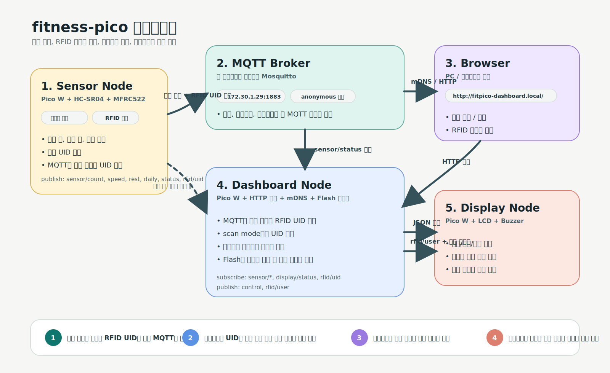

# fitness-pico

Raspberry Pi Pico 2 W 3대로 구성한 푸시업 트래커입니다. 센서 보드는 거리 센서와 RFID 태그를 읽어 MQTT로 상태를 발행하고, 대시보드 보드는 웹 UI와 사용자 전환 로직을 담당하며, 디스플레이 보드는 LCD와 부저로 즉시 피드백을 제공합니다.



## 프로젝트 개요

- `Sensor` 보드가 HC-SR04로 푸시업 동작을 계산하고 MFRC522로 RFID UID를 읽습니다.
- `Dashboard` 보드가 MQTT를 수신해 상태를 집계하고 HTTP 대시보드를 제공합니다.
- `Display` 보드가 LCD 16x2와 부저로 반복 수, 속도 경고, 사용자 전환을 표시합니다.
- `Browser`는 Dashboard 보드의 웹 UI에서 시작/종료 제어와 RFID 등록을 수행합니다.

자세한 흐름은 [docs/architecture.md](docs/architecture.md), RFID 동작은 [docs/rfid-user-flow.md](docs/rfid-user-flow.md), 배선과 네트워크 설정은 [docs/hardware-setup.md](docs/hardware-setup.md), 제출용 기술서 초안은 [docs/1차_1조_프로젝트_기술서.md](docs/1차_1조_프로젝트_기술서.md)에 정리되어 있습니다.

## 시스템 구성

- Sensor board: HC-SR04, MFRC522, MQTT publish
- Dashboard board: MQTT subscribe, HTTP server, mDNS, RFID 사용자 관리
- Display board: I2C LCD, buzzer, MQTT subscribe
- MQTT broker: 보드 간 메시지 전달
- Browser: 대시보드 접속 및 사용자 제어

## 핵심 기능

- 초음파 거리 기반 푸시업 반복 수와 세트 수 집계
- 반복 속도 경고와 휴식 상태 전송
- 웹 대시보드에서 운동 시작/종료, 칼로리 추정, 보드 상태 확인
- RFID 카드 태그 기반 사용자 전환
- 대시보드에서 RFID 사용자 등록과 현재 사용자별 통계 확인

## 저장소 구조

```text
.
├── CMakeLists.txt          # 루트 빌드 진입점
├── README.md
├── docs/
│   ├── architecture.md
│   ├── 1차_1조_프로젝트_기술서.md
│   ├── hardware-setup.md
│   ├── rfid-user-flow.md
│   └── assets/
├── Fit-pico/
│   ├── common/             # 공통 설정
│   ├── lib/                # 보조 라이브러리/서드파티 코드
│   └── src/                # firmware entry points
└── mosquitto-lan.conf      # 로컬 MQTT 브로커 예시 설정
```

빌드 산출물은 `build/`, `Fit-pico/build/`, `Fit-pico/build-lan/` 같은 생성 디렉터리에 만들어지며 저장소에는 포함하지 않습니다.

## 빠른 시작

### 1. 의존성 준비

```bash
git submodule update --init --recursive
```

### 2. 로컬 MQTT 브로커가 필요하면 실행

```bash
mosquitto -c mosquitto-lan.conf
```

### 3. 펌웨어 빌드

```bash
cmake -S Fit-pico -B build/fitpico \
  -DWIFI_SSID="YOUR_WIFI_SSID" \
  -DWIFI_PASSWORD="YOUR_WIFI_PASSWORD" \
  -DMQTT_SERVER="BROKER_IP"

cmake --build build/fitpico --target \
  fitpico_sensor fitpico_display fitpico_dashboard
```

`MQTT_USERNAME`과 `MQTT_PASSWORD`가 필요하면 같은 방식으로 CMake 캐시 값으로 넘길 수 있습니다.

## 빌드 / 플래시

생성되는 주요 펌웨어는 아래 3개입니다.

- `build/fitpico/fitpico_sensor.uf2`
- `build/fitpico/fitpico_display.uf2`
- `build/fitpico/fitpico_dashboard.uf2`

각 Pico 2 W를 BOOTSEL 모드로 연결한 뒤 대응하는 `.uf2` 파일을 복사해 플래시합니다. Dashboard 보드는 부팅 후 HTTP 서버와 mDNS를 올리며, 브라우저에서 `http://fitpico-dashboard.local/` 또는 보드 IP로 접속할 수 있습니다.

## 데모 흐름

1. MQTT 브로커를 실행하고 세 보드에 각각 `sensor`, `display`, `dashboard` 펌웨어를 올립니다.
2. 브라우저에서 Dashboard UI에 접속해 연결 상태를 확인합니다.
3. `운동 시작` 버튼으로 세션을 시작하고 센서 보드 앞에서 푸시업을 수행합니다.
4. Display 보드에서 반복 수, 속도 경고, 일일 누적 상태를 확인합니다.
5. RFID 카드를 태그해 사용자를 전환하거나, 미등록 카드면 대시보드에서 등록을 진행합니다.
6. 세션 종료 후 대시보드에서 현재 사용자 기준 통계를 확인합니다.

# 📅 First_Project: 피코보드를 이용한 푸쉬업 모니터링 시스템

**기간:** 2026.03.30 ~ 2026.04.03  
**팀 구성:** 이상수, 박찬웅, 홍지나

## 📋 프로젝트 일정 및 작업 내역

| 날짜 | 구분 | 시간 | 주요 작업 내용 |
| :--- | :--- | :--- | :--- |
| **03.30** | **전체** | **오전** | **아이디어 브레인스토밍** |
|  |  | **오후** | **주제 선정 및 역할 분담** |
| --- | --- | --- | --- |
| **03.31** | **이상수** | 오전 | 프로그램 코드 리뷰 |
|  |  | 오후 | 프로그램 코드 리뷰 |
|  | **박찬웅** | 오전 | 코드 작성 |
|  |  | 오후 | 키트 시연 해보기 |
|  | **홍지나** | 오전 | 프로그램 코드 리뷰 |
|  |  | 오후 | 프로그램 코드 리뷰 |
| --- | --- | --- | --- |
| **04.01** | **이상수** | 오전 | 깃허브 연동 문제 해결 |
|  |  | 오후 | 피코보드 구현 |
|  | **박찬웅** | 오전 | 프로그램 코드 작성 |
|  |  | 오후 | 코드 작성 및 실제 구현 |
|  | **홍지나** | 오전 | 피코 스타터팩 키트 동영상 시청 |
|  |  | 오후 | 피코보드 기기 연습 |
| --- | --- | --- | --- |
| **04.02** | **이상수** | 오전 | 프로그램 오류 수정 |
|  |  | 오후 | 시연영상 및 발표자료 제작 |
|  | **박찬웅** | 오전 | RFID기능 추가 |
|  |  | 오후 | 시연영상 제작 및 프로그램 오류 수정 |
|  | **홍지나** | 오전 | 기술서 작성  |
|  |  | 오후 | 시연영상 및 발표자료 제작 |
| --- | --- | --- | --- |
| **04.03** | **전체** | **오전** |  |
|  |  | **오후** |  |

구글 슬라이드 :https://docs.google.com/presentation/d/172OOGbRwKreQsPnrDDnOxR9YNFXfiEyQ71dwK4_FWjc/edit?usp=sharing